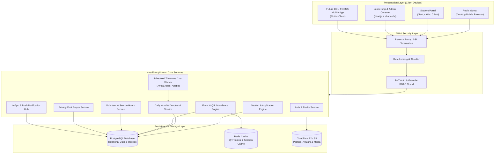
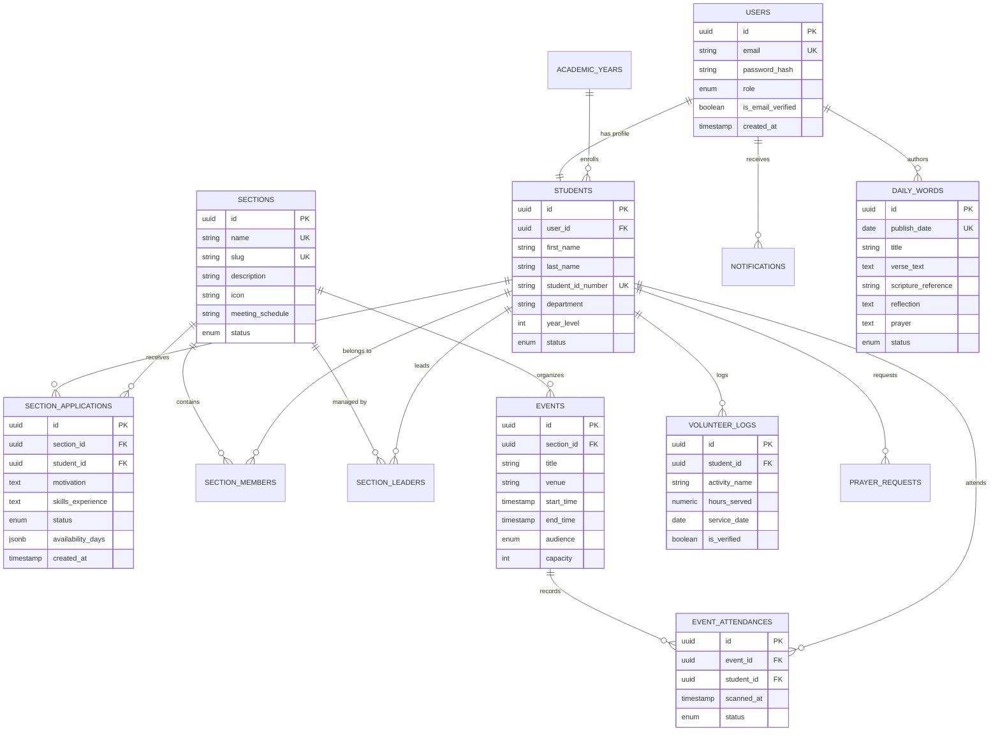
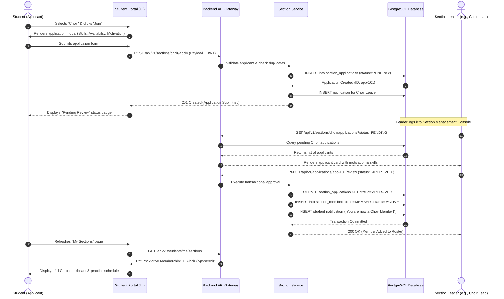
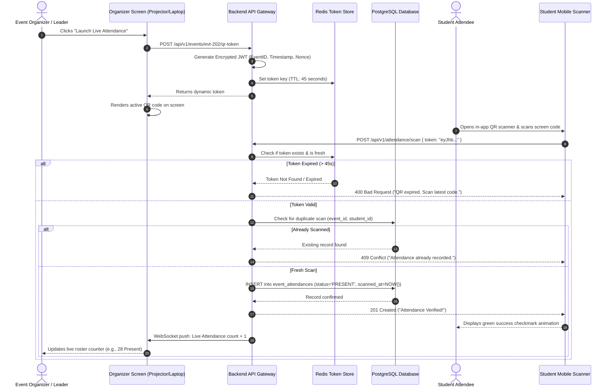
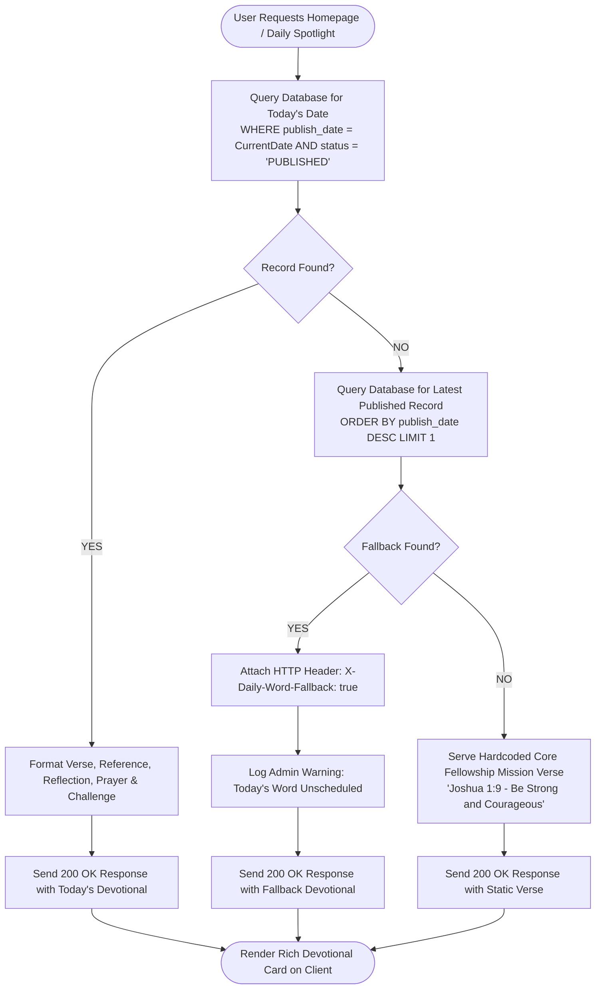

# SOFTWARE REQUIREMENTS SPECIFICATION (SRS)
## DDU FOCUS: Digital Fellowship Management & Student Community Platform
**Dire Dawa University (DDU) — Department of Software Engineering**

---

### Document Control
* **Project Name:** DDU FOCUS Student Fellowship Management & Community Platform
* **Document Version:** 1.0.0 (Comprehensive Baseline)
* **Date:** August 31, 2026
* **Target Audience:** Project Supervisors, Software Engineers, Quality Assurance Engineers, FOCUS Executive Leadership, System Administrators
* **Deployment Target:** Responsive Web Application (Next.js + NestJS + PostgreSQL), Mobile API Ready (Flutter roadmap)

---

## 1. Executive Summary & Problem Definition

### 1.1 Background & Context
The **Fellowship of Christian University Students at Dire Dawa University (DDU FOCUS)** is an active campus fellowship comprising hundreds of students organized across diverse ministry sections (such as Choir, Evangelism/EVAN, LAD, SISTA, Facility, Charity, Media, Worship, and Prayer teams). The fellowship hosts weekly fellowship meetings, Bible study cohorts, evangelistic campaigns, community volunteer initiatives, and leadership training programs.

### 1.2 Problem Statement
Currently, campus fellowship operations suffer from several operational bottlenecks:
1. **Manual & Fragmented Ministry Recruitment:** Joining a ministry section is handled via paper slips or scattered messaging channels (Telegram/WhatsApp), leading to lost applications, delayed leader reviews, and lack of application tracking for students.
2. **Inconsistent Daily Spiritual Engagement:** Daily Bible verses and reflections require manual updates on social media, leading to missed days, no organized devotional archive, and no automated scheduling.
3. **Unreliable Attendance & Participation Records:** Attendance for large fellowship services, practice sessions, and Bible study cohorts is recorded manually on paper, rendering real-time analytics and participation histories impossible.
4. **Leadership Transition Data Loss:** Annual student graduation leads to institutional memory loss. When leadership rotates each academic year, member rosters, volunteer hours, and historical records are often misplaced or erased.
5. **Privacy Risks in Pastoral Requests:** Prayer requests and counseling queries are shared in open messaging groups without privacy tiers, compromising student confidentiality.

### 1.3 Proposed Solution
The **DDU FOCUS Digital Fellowship Management & Student Community Platform** is a secure, role-based, multi-tiered digital ecosystem engineered to centralize all fellowship operations. The system unifies three core operational layers:
* **Public Website:** Inspiring public portal for campus outreach, event discovery, daily spotlights, sermons, and organizational mission.
* **Student Portal:** Personalized dashboard for section applications, dynamic QR attendance, personal spiritual journey tracking, volunteer hours logging, and private prayer requests.
* **Leadership & Admin Management Console:** Granular Role-Based Access Control (RBAC) enabling super admins, executive coordinators, and autonomous section leaders to approve applications, schedule content 365 days in advance, publish announcements, track attendance, and execute annual leadership handovers without code modifications.

---

## 2. System Architecture & High-Level Scope

```text
                               ┌────────────────────────────────────────────────────────┐
                               │                    DDU FOCUS PLATFORM                  │
                               └───────────────────────────┬────────────────────────────┘
                                                           │
               ┌───────────────────────────────────────────┼──────────────────────────────────────────┐
               │                                           │                                          │
               ▼                                           ▼                                          ▼
     ┌──────────────────┐                        ┌──────────────────┐                       ┌──────────────────┐
     │  PUBLIC WEBSITE  │                        │  STUDENT PORTAL  │                       │ ADMIN DASHBOARD  │
     └─────────┬────────┘                        └─────────┬────────┘                       └─────────┬────────┘
               │                                           │                                          │
    • Public Homepage & Vision                  • Personalized Student Hub                 • Super Admin Management
    • "Today's Word" Spotlight                  • Dynamic Section Applications             • Granular RBAC Permissions
    • Public Events Calendar                    • Application Status Tracker               • Section Leader Workflows
    • Media & Sermon Archive                    • My Sections & Practice Rosters           • 365-Day Devotional Manager
    • Public Prayer Request Wall                • QR Code Attendance Scanner               • Event & Attendance Analytics
    • Leadership Directory                      • "FOCUS Journey" Milestone Tracker        • Volunteer Hours Verification
    • Emergency Support Gateway                 • Verified Volunteer Hours Log             • Academic Year Handovers
                                                • Private Prayer Request Dispatch          • System Audit Logs
```

---

## 3. System Actors & Role-Based Access Control (RBAC)

### 3.1 Actor Definitions
1. **Public Guest (Unauthenticated User):** Campus students or visitors browsing public events, media archives, leader directories, and the Daily Word.
2. **Student (Authenticated Member):** Enrolled DDU student with a verified account. Can apply to sections, register for events, check into attendance sessions, submit prayer requests, and log volunteer hours.
3. **Section Leader (Ministry Lead):** Autonomous leader of a specific ministry (e.g., Choir Lead, EVAN Lead, Charity Lead). Has administrative rights restricted strictly to their assigned section (reviews applications, schedules practice, marks attendance, posts section announcements).
4. **Event Manager:** Officer responsible for scheduling campus-wide fellowship events, managing venue capacity, and monitoring live QR attendance.
5. **Content Manager:** Officer responsible for scheduling Daily Word entries, writing weekly devotionals, and managing study materials.
6. **Media Manager:** Officer handling sermon uploads, photo galleries, event posters, and external video links.
7. **FOCUS Coordinator (Executive Admin):** Executive campus fellowship leader managing overall fellowship health, leader assignments, reports, and cross-section activities.
8. **Super Admin:** Full administrative privileges, database maintenance, academic year transitions, role configuration, and audit logs.

### 3.2 Granular RBAC Permissions Matrix

| Functional Module / Action | Public Guest | Student | Section Leader | Event Manager | Content Manager | Media Manager | FOCUS Coordinator | Super Admin |
| :--- | :---: | :---: | :---: | :---: | :---: | :---: | :---: | :---: |
| **View Public Homepage & Daily Word** | ✅ | ✅ | ✅ | ✅ | ✅ | ✅ | ✅ | ✅ |
| **Submit Section Membership Application** | ❌ | ✅ | ✅ | ✅ | ✅ | ✅ | ✅ | ✅ |
| **Review / Approve Section Applications** | ❌ | ❌ | ✅ *(Own Section)*| ❌ | ❌ | ❌ | ✅ *(All)* | ✅ *(All)* |
| **Create / Edit Dynamic Sections** | ❌ | ❌ | ❌ | ❌ | ❌ | ❌ | ✅ | ✅ |
| **Schedule / Manage Daily Words & Devotionals** | ❌ | ❌ | ❌ | ❌ | ✅ | ❌ | ✅ | ✅ |
| **Create & Publish Events** | ❌ | ❌ | ✅ *(Section Only)* | ✅ *(Global)* | ❌ | ❌ | ✅ *(Global)* | ✅ *(Global)* |
| **Generate QR Attendance Token** | ❌ | ❌ | ✅ *(Section Meetings)* | ✅ *(Global Events)* | ❌ | ❌ | ✅ | ✅ |
| **Scan / Check-in to Event via QR** | ❌ | ✅ | ✅ | ✅ | ✅ | ✅ | ✅ | ✅ |
| **Log Volunteer Hours** | ❌ | ✅ | ✅ | ✅ | ✅ | ✅ | ✅ | ✅ |
| **Verify Volunteer Hours & Generate Certs** | ❌ | ❌ | ✅ *(Charity Lead)*| ❌ | ❌ | ❌ | ✅ | ✅ |
| **Submit Prayer Request (Private / Public)** | ❌ | ✅ | ✅ | ✅ | ✅ | ✅ | ✅ | ✅ |
| **Review & Moderate Prayer Requests** | ❌ | ❌ | ❌ | ❌ | ❌ | ❌ | ✅ | ✅ |
| **Manage Media, Sermons & Gallery** | ❌ | ❌ | ❌ | ❌ | ❌ | ✅ | ✅ | ✅ |
| **Manage Academic Years & Leader Transitions** | ❌ | ❌ | ❌ | ❌ | ❌ | ❌ | ❌ | ✅ |
| **View Audit Logs & Security Diagnostics** | ❌ | ❌ | ❌ | ❌ | ❌ | ❌ | ❌ | ✅ |

---

## 4. Functional Requirements (Categorized)

### Module 1: Authentication, Authorization & User Profile Management
* **FR-1.1: User Registration:** Students shall register using their institutional/personal email, full name, student ID number, university department, and academic year.
* **FR-1.2: Password Security & Token Exchange:** Authentication shall utilize JWT access tokens (15-minute lifespan) and secure `httpOnly` refresh tokens (7-day lifespan) with Argon2/bcrypt password hashing.
* **FR-1.3: Profile Customization:** Students can update contact phone numbers, dorm/campus residence, bio, spiritual gifts, and avatar photos.
* **FR-1.4: Academic Status Tracking:** The system shall record student status (`ACTIVE`, `GRADUATED`, `ALUMNI`, `INACTIVE`, `SUSPENDED`) linked to their specific academic batch.
* **FR-1.5: Role-Based Routing:** Upon login, the authentication handler shall inspect the user's role and redirect to the corresponding workspace (Student Portal, Leader Dashboard, or Super Admin Console).

### Module 2: Ministry & Section Management (Dynamic Extensibility)
* **FR-2.1: Dynamic Section Creation:** Administrators shall create new fellowship sections without altering code. Parameters include: `Name`, `Slug`, `Category`, `Icon`, `Cover Image`, `Description`, `Meeting Schedule`, `Location`, `Max Capacity`, and `Status` (`ACTIVE`, `INACTIVE`).
* **FR-2.2: Initial Seed Sections:** The system shall support Choir, EVAN (Evangelism), LAD (Brothers/Men's Fellowship), SISTA (Sisters' Fellowship), Facility/Service Team, and Charity by default.
* **FR-2.3: Section Leadership Assignment:** The system shall support assigning one or more verified students as Section Leaders with defined start and end dates.
* **FR-2.4: Section Public Showcase:** Each section shall have a dedicated public landing page displaying its mission, leaders, meeting schedule, upcoming open practices, resources, and gallery.

### Module 3: Section Membership Application & Approval Workflow
* **FR-3.1: Application Submission:** Enrolled students shall submit an application to join any active section. Fields include:
  * Motivation statement (*"Why do you want to join?"*)
  * Skills and relevant background experience
  * Weekly day-by-day availability checklist (Monday–Sunday)
  * Experience tier (`BEGINNER`, `INTERMEDIATE`, `EXPERIENCED`)
* **FR-3.2: Application State Machine:** Applications shall transition through strict states: `PENDING` $\rightarrow$ `APPROVED` | `REJECTED` | `WAITLISTED` | `WITHDRAWN`.
* **FR-3.3: Autonomous Leader Review Dashboard:** Assigned Section Leaders shall view only pending applications for their specific section, inspect applicant profiles, and click **Approve** or **Reject** with optional reviewer feedback notes.
* **FR-3.4: Auto-Membership Sync:** Upon approval, the applicant is automatically added to `section_members` as an `ACTIVE` member.
* **FR-3.5: Real-Time Notification Trigger:** The system shall instantly dispatch an in-app notification (and optional email/Telegram alert) to the student when their application status updates.
* **FR-3.6: Student "My Sections" Hub:** Students shall view all their memberships, pending submissions, review statuses, and assigned section meetings on a dedicated page.

### Module 4: "Daily FOCUS" Automated Devotional & Spotlight Engine
* **FR-4.1: Scheduled Daily Word Content:** Content managers shall schedule Daily Word entries up to 365 days in advance. Schema includes: `Date`, `Title`, `Verse Text`, `Scripture Reference`, `Reflection`, `Prayer`, `Today's Challenge`, `Cover Image`, and `Status` (`SCHEDULED`, `PUBLISHED`).
* **FR-4.2: Timezone-Aware Auto-Publishing:** At `00:00:00` East Africa Time (`UTC+3 / Africa/Addis_Ababa`), the background worker shall transition the current day's `SCHEDULED` word to `PUBLISHED` and serve it to the homepage.
* **FR-4.3: Intelligent Fail-Safe Fallback:** If no record is scheduled for the current date, the backend shall query the most recent `PUBLISHED` entry and alert administrators via a dashboard banner: *"⚠️ Today's Daily Word hasn't been scheduled. Displaying fallback."*
* **FR-4.4: Public & Student Spotlight Widgets:** The homepage and student dashboard shall render a rich devotional widget displaying the verse, reflection modal, prayer accordion, and practical challenge.
* **FR-4.5: Devotional Archive & Search:** Students can browse, filter, and search past devotionals by topic, scripture book, or date.

### Module 5: Event Management & Smart Audience Access Control
* **FR-5.1: Event Creation & Categorization:** Event Managers and Section Leaders can schedule events (e.g., Weekly Fellowship, Choir Practice, EVAN Outreach, Retreats, Leadership Conferences). Attributes: `Title`, `Description`, `Start Time`, `End Time`, `Venue`, `Audience Type`, `Capacity`, and `Poster Banner`.
* **FR-5.2: Audience Filtering (Smart Access):**
  * `PUBLIC`: Visible and open to all university students.
  * `MEMBERS_ONLY`: Restricted strictly to approved members of the organizing section (e.g., closed Choir rehearsals).
* **FR-5.3: Event RSVP & Capacity Management:** Students can RSVP with one click. The system prevents over-registration once max capacity is reached.
* **FR-5.4: Interactive Fellowship Calendar:** Students can view a color-coded calendar filtering events across global fellowship programs and joined sections.

### Module 6: Dynamic QR Attendance System
* **FR-6.1: Time-Expiring QR Token Generation:** During an active event, the organizer/leader can display a dynamic QR code on their screen or project it in the hall. The QR code contains an encrypted, time-limited cryptographic token (rotating every 30–60 seconds to prevent link sharing).
* **FR-6.2: In-App QR Scanner:** Students scan the displayed QR code using their smartphone camera through the web application scanner component.
* **FR-6.3: Attendance Validation & Deduplication:** The backend validates token validity, user session, and event window, recording `PRESENT` with an exact timestamp while blocking duplicate scans.
* **FR-6.4: Live Leader Attendance Roster:** Leaders can view real-time headcount (`Present`, `Absent`, `Late`) and export attendance logs as CSV/PDF.

### Module 7: Student "FOCUS Journey" & Participation Profile
* **FR-7.1: Personal Milestones Tracker:** Non-competitive milestone dashboard visualizing:
  * Sections Joined count
  * Total Fellowship Events Attended
  * Bible Study Sessions Completed
  * Verified Volunteer Hours
  * Active Fellowship Tenure (Years)
* **FR-7.2: New Student Onboarding Checklist:** Step-by-step interactive onboarding card:
  1. Complete Student Profile $\rightarrow$ 2. Explore & Apply to a Section $\rightarrow$ 3. Attend First Fellowship Service $\rightarrow$ 4. Read Today's Devotional $\rightarrow$ 5. Connect with Ministry Leader.

### Module 8: Volunteer & Service Hours Tracking (Charity & Community Service)
* **FR-8.1: Volunteer Activity Logging:** Students participating in Charity campaigns, campus cleanups, or peer tutoring log their service hours with task descriptions and dates.
* **FR-8.2: Leader Verification:** Charity Leaders review submitted hours and grant official verification.
* **FR-8.3: Service Certificate Generation:** When a student surpasses required service thresholds, the system dynamically generates a downloadable PDF **DDU FOCUS Certificate of Community Service** with a verification QR code.

### Module 9: Privacy-First Prayer & Counseling Gateway
* **FR-9.1: Tiered Visibility Prayer Requests:** Students can submit prayer requests under three strict confidentiality settings:
  1. `LEADERS_ONLY`: Visible only to approved pastoral leaders and FOCUS executive coordinators.
  2. `PRAYER_TEAM`: Visible exclusively to the verified intercessory prayer section.
  3. `ANONYMOUS_COMMUNITY`: Published to the public prayer wall with the student's name hidden.
* **FR-9.2: "Prayed for You" Counter:** Community members viewing approved anonymous prayer requests can click a *"I Prayed for This"* button, incrementing a real-time counter to encourage the requester.
* **FR-9.3: Emergency Contact & Support Gateway:** Dedicated "Need Someone to Talk To?" page providing direct, confidential contact cards for designated spiritual counselors and emergency leadership lines (with clear non-clinical peer support disclosures).

### Module 10: Curated Testimonies & Resource Media Library
* **FR-10.1: Testimony Submission & Moderation:** Students can submit written testimonies. Content remains `PENDING_REVIEW` until an admin verifies and publishes it.
* **FR-10.2: Multi-Format Resource Center:** Categorized repository supporting downloadable PDFs (Bible study guides, discipleship notes), audio sermons, and embedded YouTube/Vimeo video streams.
* **FR-10.3: Full-Text Global Search:** Universal search bar allowing users to search across sections, events, resources, sermons, and announcements with instant suggestions.

### Module 11: Targeted & Broadcast Announcements
* **FR-11.1: Global Broadcasts:** Executive announcements displayed on the homepage and student dashboards.
* **FR-11.2: Section-Scoped Announcements:** Ministry updates (e.g., *"Choir practice postponed to 6:30 PM"*) visible only to approved members of that section.

### Module 12: Academic Year Management & Leadership Continuity
* **FR-12.1: Academic Year Lifecycle:** System admins configure active academic periods (e.g., `2026/2027`). Historical data (memberships, attendance, leader terms) is archived and remains queryable.
* **FR-12.2: Seamless Leadership Transition:** Admins can rotate section leaders for the upcoming term by updating leader tenure records without needing to create new database tables or rebuild the application.

---

## 5. Non-Functional Requirements (NFRs)

### 5.1 Performance & Latency Requirements
* **NFR-1.1 (Response Times):** 95% of standard REST API endpoints shall respond in under $200\text{ ms}$ under normal campus load ($1{,}000$ concurrent active connections).
* **NFR-1.2 (Core Web Vitals):** The public web portal shall achieve a Largest Contentful Paint (LCP) $< 1.8\text{ s}$ and Cumulative Layout Shift (CLS) $< 0.05$ on mobile 4G networks.
* **NFR-1.3 (Database Indexing):** Date-based queries (such as Daily Word lookups and event calendar queries) must leverage B-tree indexes ensuring execution times $< 15\text{ ms}$.

### 5.2 Security & Data Privacy
* **NFR-2.1 (Transport Encryption):** All traffic must be enforced over TLS 1.3 with HSTS headers enabled.
* **NFR-2.2 (Token Storage):** JWT access tokens stored in memory; refresh tokens stored strictly in `httpOnly`, `secure`, `SameSite=Strict` cookies.
* **NFR-2.3 (Data Sanitization & Validation):** All incoming API payloads validated with class-validator/Zod schemas; parameterized SQL queries via Prisma ORM preventing SQL injection.
* **NFR-2.4 (Pastoral Privacy Compliance):** `LEADERS_ONLY` prayer requests must be physically shielded at the database query level through row-level access control filters.

### 5.3 Reliability, Availability & Timezone Handling
* **NFR-3.1 (Uptime SLA):** Target $99.9\%$ uptime during active academic semesters.
* **NFR-3.2 (Deterministic Timezone Engine):** All server timestamps stored in UTC (`TIMESTAMPTZ`) and converted deterministically to `Africa/Addis_Ababa` (UTC+3) for devotional switches and event schedules.
* **NFR-3.3 (Automated Fallback Guarantee):** Zero blank page states allowed for the Daily Word widget under any database condition.

### 5.4 Usability & Cross-Platform Responsiveness
* **NFR-4.1 (Mobile-First UI):** Fully responsive across viewports from $320\text{ px}$ (budget smartphones) to $4\text{K}$ desktop monitors.
* **NFR-4.2 (Accessibility):** WCAG 2.1 Level AA compliance, high contrast ratio $> 4.5:1$, keyboard navigability, and ARIA labels on all modal and QR components.

---

## 6. Formal Use Case Specifications

### Use Case UC-01: Apply for Ministry Section Membership
* **Primary Actor:** Registered Student
* **Preconditions:** Student is authenticated with an `ACTIVE` account status and is not already an active member of the target section.
* **Main Success Scenario:**
  1. Student navigates to the "Ministry Sections" page and selects a target section (e.g., *Choir*).
  2. Student reviews section details, schedule, and expectations, then clicks **"Join Section"**.
  3. System renders the multi-step application modal.
  4. Student inputs motivation, experience level, musical/technical skills, and marks weekly availability checkboxes.
  5. Student submits the application.
  6. System validates the payload, creates a record in `section_applications` with status `PENDING`, and generates an audit event.
  7. System renders confirmation toast: *"Your application has been submitted for Leader review."*
  8. System dispatches notification to the assigned Section Leader(s).
* **Alternate Flows:**
  * *4a. Missing Required Fields:* System highlights invalid fields with inline error messages; submission blocked.
  * *6a. Duplicate Application:* If an active or pending application exists for this student and section, system displays notice: *"You already have a pending application for this section."*

---

### Use Case UC-02: Section Leader Application Review & Approval
* **Primary Actor:** Section Leader (e.g., Choir Leader)
* **Preconditions:** Leader is authenticated; user role possesses `SECTION_LEADER` permissions scoped to target section.
* **Main Success Scenario:**
  1. Leader logs into the Leader Portal and opens the "Pending Applications" tab.
  2. System queries and displays all applications where `section_id = leader.assigned_section_id` and `status = 'PENDING'`.
  3. Leader clicks on applicant record to inspect full details (motivation, availability, experience).
  4. Leader selects **"Approve Application"** and enters optional welcoming remarks.
  5. System initiates a database transaction:
     * Updates `section_applications` status to `APPROVED`.
     * Inserts new row into `section_members` (`role = 'MEMBER'`, `status = 'ACTIVE'`, `joined_at = NOW()`).
     * Increments active member count in `sections`.
     * Creates an in-app notification for the applicant.
  6. Leader dashboard reflects updated roster in real time.
* **Alternate Flows:**
  * *4b. Leader Rejects Application:* Leader enters constructive feedback; system updates status to `REJECTED`, creates rejection notification, and closes review flow without adding member.

---

### Use Case UC-03: Automated Daily Word Fetch & Fail-Safe Fallback
* **Primary Actor:** System Cron Worker / Public Guest
* **Preconditions:** Client requests current daily devotional widget on homepage load.
* **Main Success Scenario:**
  1. Client sends GET `/api/v1/daily-word/today`.
  2. Backend computes current date in `Africa/Addis_Ababa` timezone (`YYYY-MM-DD`).
  3. Backend queries database: `SELECT * FROM daily_words WHERE publish_date = :today AND status = 'PUBLISHED' LIMIT 1`.
  4. Record found: Backend formats and returns the verse, scripture reference, reflection, prayer, and challenge with `200 OK`.
  5. Client displays the rich devotional spotlight banner.
* **Alternate Flows (Fail-Safe Fallback):**
  * *3a. No Record Scheduled for Today:*
    1. Backend catches empty result set.
    2. Backend queries fallback: `SELECT * FROM daily_words WHERE status = 'PUBLISHED' ORDER BY publish_date DESC LIMIT 1`.
    3. Backend attaches response header `X-Daily-Word-Fallback: true`.
    4. Backend logs warning event to system diagnostics table.
    5. Client renders the fallback devotional cleanly without UI errors.

---

### Use Case UC-04: Mark Event Attendance via Dynamic QR Code
* **Primary Actor:** Student (Attendee) & Event Manager (Organizer)
* **Preconditions:** Event is currently within its active time window; student is authenticated on mobile browser.
* **Main Success Scenario:**
  1. Event Leader clicks **"Start Attendance Session"** in the Event Console.
  2. System generates an encrypted, time-stamped JWT payload: `token = Encrypt({ eventId, exp: now + 45s, salt })`.
  3. Leader displays live QR code on screen (refreshes automatically every 30 seconds).
  4. Student opens in-app camera scanner on their smartphone and scans the QR code.
  5. Student app sends POST `/api/v1/attendance/scan` with payload `{ token }`.
  6. Backend decrypts token, verifies timestamp freshness ($< 60\text{ s}$ skew), verifies student is not already marked present, and records attendance row with `status = 'PRESENT'`.
  7. Backend returns `201 Created` with message: *"Attendance marked successfully for [Event Name]!"*
  8. Student phone displays animated success badge; leader live counter increments by 1.
* **Alternate Flows:**
  * *6a. Expired / Stale Token:* Backend rejects scan with `400 Bad Request` (*"QR Code has expired. Please scan the current code on screen."*).
  * *6b. Duplicate Scan:* Backend detects existing attendance record and returns `409 Conflict` (*"Attendance already recorded for this event."*).

---

## 7. Relational Database Schema (PostgreSQL DDL & Data Models)

```
                               ┌─────────────────────────┐
                               │       users             │
                               ├─────────────────────────┤
                               │ id (PK)                 │
                               │ email                   │
                               │ password_hash           │
                               │ role (enum)             │
                               │ status (enum)           │
                               └────────────┬────────────┘
                                            │ 1:1
                                            ▼
                               ┌─────────────────────────┐
                               │       students          │
                               ├─────────────────────────┤
                               │ id (PK)                 │
                               │ user_id (FK)            │
                               │ first_name, last_name   │
                               │ student_id_number       │
                               │ department, year_level  │
                               │ academic_year_id (FK)   │
                               └───────┬──────────┬──────┘
                                       │          │
                     ┌─────────────────┘          └─────────────────┐
                     │ 1:N                                          │ 1:N
                     ▼                                              ▼
        ┌─────────────────────────┐                    ┌─────────────────────────┐
        │   section_applications  │                    │   event_attendances     │
        ├─────────────────────────┤                    ├─────────────────────────┤
        │ id (PK)                 │                    │ id (PK)                 │
        │ student_id (FK)         │                    │ event_id (FK)           │
        │ section_id (FK)         │                    │ student_id (FK)         │
        │ status (enum)           │                    │ scanned_at              │
        │ motivation, skills      │                    │ status (enum)           │
        └────────────┬────────────┘                    └─────────────────────────┘
                     │ N:1
                     ▼
        ┌─────────────────────────┐
        │       sections          │
        ├─────────────────────────┤
        │ id (PK)                 │
        │ name, slug              │
        │ icon, cover_image       │
        │ meeting_schedule        │
        │ status (enum)           │
        └───────┬──────────┬──────┘
                │          │
          1:N   │          │ 1:N
     ┌──────────┘          └──────────┐
     ▼                                ▼
┌─────────────────────────┐      ┌─────────────────────────┐
│     section_leaders     │      │     section_members     │
├─────────────────────────┤      ├─────────────────────────┤
│ id (PK)                 │      │ id (PK)                 │
│ section_id (FK)         │      │ section_id (FK)         │
│ student_id (FK)         │      │ student_id (FK)         │
│ term_start, term_end    │      │ role, status (enum)     │
└─────────────────────────┘      └─────────────────────────┘
```

### Complete SQL DDL Definition (PostgreSQL 15+)

```sql
-- DDU FOCUS POSTGRESQL DATABASE SCHEMA
-- Extensions
CREATE EXTENSION IF NOT EXISTS "uuid-ossp";
CREATE EXTENSION IF NOT EXISTS "pgcrypto";

-- ENUMS
CREATE TYPE user_role_enum AS ENUM (
    'SUPER_ADMIN',
    'FOCUS_COORDINATOR',
    'SECTION_LEADER',
    'EVENT_MANAGER',
    'CONTENT_MANAGER',
    'MEDIA_MANAGER',
    'STUDENT'
);

CREATE TYPE student_status_enum AS ENUM ('ACTIVE', 'GRADUATED', 'ALUMNI', 'INACTIVE', 'SUSPENDED');
CREATE TYPE application_status_enum AS ENUM ('PENDING', 'APPROVED', 'REJECTED', 'WAITLISTED', 'WITHDRAWN');
CREATE TYPE member_role_enum AS ENUM ('MEMBER', 'ASSISTANT_LEADER', 'LEADER');
CREATE TYPE audience_type_enum AS ENUM ('PUBLIC', 'MEMBERS_ONLY');
CREATE TYPE attendance_status_enum AS ENUM ('PRESENT', 'ABSENT', 'LATE', 'EXCUSED');
CREATE TYPE prayer_visibility_enum AS ENUM ('LEADERS_ONLY', 'PRAYER_TEAM', 'ANONYMOUS_COMMUNITY');
CREATE TYPE content_status_enum AS ENUM ('DRAFT', 'SCHEDULED', 'PUBLISHED', 'ARCHIVED');
CREATE TYPE resource_category_enum AS ENUM ('BIBLE_STUDY', 'SERMON', 'WORSHIP', 'BOOK', 'DISCIPLESHIP', 'DOCUMENT');

-- 1. ACADEMIC YEARS
CREATE TABLE academic_years (
    id UUID PRIMARY KEY DEFAULT uuid_generate_v4(),
    year_label VARCHAR(50) NOT NULL UNIQUE, -- e.g., '2026/2027'
    is_current BOOLEAN DEFAULT false,
    start_date DATE NOT NULL,
    end_date DATE NOT NULL,
    created_at TIMESTAMPTZ DEFAULT CURRENT_TIMESTAMP
);

-- 2. USERS
CREATE TABLE users (
    id UUID PRIMARY KEY DEFAULT uuid_generate_v4(),
    email VARCHAR(255) NOT NULL UNIQUE,
    password_hash VARCHAR(255) NOT NULL,
    role user_role_enum NOT NULL DEFAULT 'STUDENT',
    is_email_verified BOOLEAN DEFAULT false,
    created_at TIMESTAMPTZ DEFAULT CURRENT_TIMESTAMP,
    updated_at TIMESTAMPTZ DEFAULT CURRENT_TIMESTAMP
);

-- 3. STUDENTS
CREATE TABLE students (
    id UUID PRIMARY KEY DEFAULT uuid_generate_v4(),
    user_id UUID NOT NULL UNIQUE REFERENCES users(id) ON DELETE CASCADE,
    first_name VARCHAR(100) NOT NULL,
    last_name VARCHAR(100) NOT NULL,
    student_id_number VARCHAR(50) NOT NULL UNIQUE,
    department VARCHAR(150) NOT NULL,
    year_level INT NOT NULL CHECK (year_level BETWEEN 1 AND 7),
    phone_number VARCHAR(30),
    avatar_url TEXT,
    bio TEXT,
    status student_status_enum DEFAULT 'ACTIVE',
    academic_year_id UUID REFERENCES academic_years(id),
    created_at TIMESTAMPTZ DEFAULT CURRENT_TIMESTAMP,
    updated_at TIMESTAMPTZ DEFAULT CURRENT_TIMESTAMP
);

-- 4. SECTIONS (MINISTRIES)
CREATE TABLE sections (
    id UUID PRIMARY KEY DEFAULT uuid_generate_v4(),
    name VARCHAR(100) NOT NULL UNIQUE,
    slug VARCHAR(100) NOT NULL UNIQUE,
    description TEXT NOT NULL,
    icon VARCHAR(50) DEFAULT 'Users',
    cover_image_url TEXT,
    meeting_schedule VARCHAR(255),
    meeting_location VARCHAR(255),
    max_members INT DEFAULT 100,
    status content_status_enum DEFAULT 'PUBLISHED',
    created_at TIMESTAMPTZ DEFAULT CURRENT_TIMESTAMP,
    updated_at TIMESTAMPTZ DEFAULT CURRENT_TIMESTAMP
);

-- 5. SECTION LEADERS
CREATE TABLE section_leaders (
    id UUID PRIMARY KEY DEFAULT uuid_generate_v4(),
    section_id UUID NOT NULL REFERENCES sections(id) ON DELETE CASCADE,
    student_id UUID NOT NULL REFERENCES students(id) ON DELETE CASCADE,
    title VARCHAR(100) DEFAULT 'Section Leader',
    term_start DATE NOT NULL,
    term_end DATE,
    is_active BOOLEAN DEFAULT true,
    created_at TIMESTAMPTZ DEFAULT CURRENT_TIMESTAMP,
    UNIQUE(section_id, student_id, term_start)
);

-- 6. SECTION APPLICATIONS
CREATE TABLE section_applications (
    id UUID PRIMARY KEY DEFAULT uuid_generate_v4(),
    section_id UUID NOT NULL REFERENCES sections(id) ON DELETE CASCADE,
    student_id UUID NOT NULL REFERENCES students(id) ON DELETE CASCADE,
    student_name VARCHAR(150),
    student_dept VARCHAR(150),
    student_year INT,
    gender VARCHAR(10) DEFAULT 'MALE',
    phone_number VARCHAR(30),
    student_id_number VARCHAR(50),
    dorm_info VARCHAR(100),
    spiritual_background TEXT,
    motivation TEXT NOT NULL,
    skills_experience TEXT,
    experience_level VARCHAR(50) DEFAULT 'BEGINNER',
    availability_days JSONB NOT NULL DEFAULT '[]'::jsonb, -- e.g. ["Monday", "Friday"]
    status application_status_enum DEFAULT 'PENDING',
    reviewer_id UUID REFERENCES students(id),
    review_notes TEXT,
    reviewed_at TIMESTAMPTZ,
    created_at TIMESTAMPTZ DEFAULT CURRENT_TIMESTAMP,
    updated_at TIMESTAMPTZ DEFAULT CURRENT_TIMESTAMP,
    UNIQUE(section_id, student_id, status)
);

-- 7. SECTION MEMBERS
CREATE TABLE section_members (
    id UUID PRIMARY KEY DEFAULT uuid_generate_v4(),
    section_id UUID NOT NULL REFERENCES sections(id) ON DELETE CASCADE,
    student_id UUID NOT NULL REFERENCES students(id) ON DELETE CASCADE,
    role member_role_enum DEFAULT 'MEMBER',
    joined_at TIMESTAMPTZ DEFAULT CURRENT_TIMESTAMP,
    is_active BOOLEAN DEFAULT true,
    UNIQUE(section_id, student_id)
);

-- 8. EVENTS
CREATE TABLE events (
    id UUID PRIMARY KEY DEFAULT uuid_generate_v4(),
    section_id UUID REFERENCES sections(id) ON DELETE SET NULL, -- NULL = Global Fellowship Event
    title VARCHAR(255) NOT NULL,
    slug VARCHAR(255) NOT NULL UNIQUE,
    description TEXT NOT NULL,
    venue VARCHAR(255) NOT NULL,
    speaker_name VARCHAR(150),
    poster_url TEXT,
    start_time TIMESTAMPTZ NOT NULL,
    end_time TIMESTAMPTZ NOT NULL,
    audience audience_type_enum DEFAULT 'PUBLIC',
    capacity INT,
    status content_status_enum DEFAULT 'PUBLISHED',
    created_by UUID REFERENCES users(id),
    created_at TIMESTAMPTZ DEFAULT CURRENT_TIMESTAMP
);

-- 9. EVENT REGISTRATIONS
CREATE TABLE event_registrations (
    id UUID PRIMARY KEY DEFAULT uuid_generate_v4(),
    event_id UUID NOT NULL REFERENCES events(id) ON DELETE CASCADE,
    student_id UUID NOT NULL REFERENCES students(id) ON DELETE CASCADE,
    registered_at TIMESTAMPTZ DEFAULT CURRENT_TIMESTAMP,
    UNIQUE(event_id, student_id)
);

-- 10. EVENT ATTENDANCES (QR SCAN RECORDS)
CREATE TABLE event_attendances (
    id UUID PRIMARY KEY DEFAULT uuid_generate_v4(),
    event_id UUID NOT NULL REFERENCES events(id) ON DELETE CASCADE,
    student_id UUID NOT NULL REFERENCES students(id) ON DELETE CASCADE,
    scanned_at TIMESTAMPTZ DEFAULT CURRENT_TIMESTAMP,
    status attendance_status_enum DEFAULT 'PRESENT',
    verified_by UUID REFERENCES users(id),
    UNIQUE(event_id, student_id)
);

-- 11. DAILY WORDS (AUTOMATIC 365-DAY DEVOTIONALS)
CREATE TABLE daily_words (
    id UUID PRIMARY KEY DEFAULT uuid_generate_v4(),
    publish_date DATE NOT NULL UNIQUE, -- Unique index for O(1) daily lookup
    title VARCHAR(255) NOT NULL,
    verse_text TEXT NOT NULL,
    scripture_reference VARCHAR(150) NOT NULL,
    reflection TEXT NOT NULL,
    prayer TEXT NOT NULL,
    challenge TEXT,
    cover_image_url TEXT,
    status content_status_enum DEFAULT 'SCHEDULED',
    created_by UUID REFERENCES users(id),
    created_at TIMESTAMPTZ DEFAULT CURRENT_TIMESTAMP
);

-- 12. PRAYER REQUESTS (PRIVACY-FIRST)
CREATE TABLE prayer_requests (
    id UUID PRIMARY KEY DEFAULT uuid_generate_v4(),
    student_id UUID REFERENCES students(id) ON DELETE SET NULL,
    title VARCHAR(255) NOT NULL,
    request_body TEXT NOT NULL,
    visibility prayer_visibility_enum DEFAULT 'LEADERS_ONLY',
    is_answered BOOLEAN DEFAULT false,
    answered_testimony TEXT,
    prayed_count INT DEFAULT 0,
    created_at TIMESTAMPTZ DEFAULT CURRENT_TIMESTAMP
);

-- 13. VOLUNTEER ACTIVITIES & HOURS LOG
CREATE TABLE volunteer_logs (
    id UUID PRIMARY KEY DEFAULT uuid_generate_v4(),
    student_id UUID NOT NULL REFERENCES students(id) ON DELETE CASCADE,
    section_id UUID REFERENCES sections(id),
    activity_name VARCHAR(255) NOT NULL,
    hours_served NUMERIC(5, 2) NOT NULL CHECK (hours_served > 0),
    service_date DATE NOT NULL,
    description TEXT,
    is_verified BOOLEAN DEFAULT false,
    verified_by UUID REFERENCES students(id),
    created_at TIMESTAMPTZ DEFAULT CURRENT_TIMESTAMP
);

-- 14. RESOURCES & SERMONS
CREATE TABLE resources (
    id UUID PRIMARY KEY DEFAULT uuid_generate_v4(),
    section_id UUID REFERENCES sections(id) ON DELETE SET NULL,
    title VARCHAR(255) NOT NULL,
    category resource_category_enum NOT NULL,
    speaker_author VARCHAR(150),
    file_url TEXT,
    external_media_url TEXT, -- YouTube, Vimeo, Spotify embed link
    file_size_bytes BIGINT,
    description TEXT,
    created_at TIMESTAMPTZ DEFAULT CURRENT_TIMESTAMP
);

-- 15. ANNOUNCEMENTS
CREATE TABLE announcements (
    id UUID PRIMARY KEY DEFAULT uuid_generate_v4(),
    section_id UUID REFERENCES sections(id) ON DELETE CASCADE, -- NULL = All Fellowship
    title VARCHAR(255) NOT NULL,
    content TEXT NOT NULL,
    priority VARCHAR(50) DEFAULT 'NORMAL', -- 'NORMAL', 'HIGH', 'URGENT'
    expires_at TIMESTAMPTZ,
    created_by UUID REFERENCES users(id),
    created_at TIMESTAMPTZ DEFAULT CURRENT_TIMESTAMP
);

-- 16. NOTIFICATIONS
CREATE TABLE notifications (
    id UUID PRIMARY KEY DEFAULT uuid_generate_v4(),
    user_id UUID NOT NULL REFERENCES users(id) ON DELETE CASCADE,
    title VARCHAR(255) NOT NULL,
    message TEXT NOT NULL,
    action_url TEXT,
    is_read BOOLEAN DEFAULT false,
    created_at TIMESTAMPTZ DEFAULT CURRENT_TIMESTAMP
);

-- 17. AUDIT LOGS
CREATE TABLE audit_logs (
    id UUID PRIMARY KEY DEFAULT uuid_generate_v4(),
    actor_id UUID REFERENCES users(id) ON DELETE SET NULL,
    action VARCHAR(100) NOT NULL,
    entity_type VARCHAR(100) NOT NULL,
    entity_id UUID,
    metadata JSONB,
    ip_address VARCHAR(45),
    created_at TIMESTAMPTZ DEFAULT CURRENT_TIMESTAMP
);

-- OPTIMIZATION INDEXES
CREATE INDEX idx_daily_words_lookup ON daily_words (publish_date, status);
CREATE INDEX idx_events_start_time ON events (start_time, audience);
CREATE INDEX idx_applications_section_status ON section_applications (section_id, status);
CREATE INDEX idx_attendances_event ON event_attendances (event_id, student_id);
CREATE INDEX idx_notifications_user ON notifications (user_id, is_read);
```

---

## 8. RESTful API Specification (Endpoints Matrix)

| Method | Endpoint Route | Request Body / Query Params | Protected Roles | Description |
| :--- | :--- | :--- | :--- | :--- |
| **POST** | `/api/v1/auth/register` | `{ email, password, firstName, lastName, studentId, dept, year }` | Public | Registers a new student account. |
| **POST** | `/api/v1/auth/login` | `{ email, password }` | Public | Authenticates credentials, returns JWT & sets refresh cookie. |
| **GET** | `/api/v1/auth/me` | `Bearer Token` | Authenticated | Retrieves active user session & profile permissions. |
| **GET** | `/api/v1/sections` | `?category=&status=PUBLISHED` | Public | Lists all active fellowship sections with member stats. |
| **POST** | `/api/v1/sections` | `{ name, slug, description, icon, schedule, location }` | Coordinator, Super Admin | Dynamically registers a new fellowship section. |
| **POST** | `/api/v1/sections/:slug/apply`| `{ motivation, skills, experienceLevel, availabilityDays }` | Student | Submits membership application to specified section. |
| **GET** | `/api/v1/sections/:id/applications`| `?status=PENDING` | Section Leader, Super Admin | Lists applications for leader's assigned section. |
| **PATCH**| `/api/v1/applications/:id/review`| `{ status: 'APPROVED'\|'REJECTED', reviewNotes }` | Section Leader, Super Admin | Approves or rejects a student membership application. |
| **GET** | `/api/v1/students/me/sections` | `Bearer Token` | Student | Returns student's active sections and application statuses. |
| **GET** | `/api/v1/daily-word/today` | None | Public | Retrieves today's active Daily Word (or fail-safe fallback). |
| **POST** | `/api/v1/daily-word` | `{ publishDate, title, verseText, reference, reflection, prayer }`| Content Mgr, Super Admin| Schedules a new Daily Word in the 365-day queue. |
| **GET** | `/api/v1/events` | `?month=&sectionId=&audience=` | Public | Queries calendar events with audience filters. |
| **POST** | `/api/v1/events/:id/qr-token` | None | Event Mgr, Section Leader | Generates 45-second rotating attendance token. |
| **POST** | `/api/v1/attendance/scan` | `{ token }` | Student | Validates QR token and logs student attendance. |
| **GET** | `/api/v1/students/me/journey` | `Bearer Token` | Student | Fetches student participation metrics and milestone checklist. |
| **POST** | `/api/v1/volunteers/log` | `{ activityName, hoursServed, serviceDate, description }` | Student | Logs volunteer/service hours for Charity team review. |
| **POST** | `/api/v1/prayers` | `{ title, requestBody, visibility }` | Student | Submits prayer request with privacy settings. |
| **GET** | `/api/v1/prayers/public` | `?page=1` | Public | Returns anonymous public prayer requests for community prayer. |
| **POST** | `/api/v1/prayers/:id/pray` | None | Authenticated | Increments "I Prayed for This" encouragement counter. |

---

## 9. Visual UML & Architecture Diagram Models

### 9.1 High-Level System Architecture Diagram (Mermaid)



---

### 9.2 Complete Entity Relationship Diagram (ERD)



---

### 9.3 Section Membership Application Workflow (Sequence Diagram)



---

### 9.4 Dynamic QR Attendance Workflow (Sequence Diagram)



---

### 9.5 Automated Daily Word Publishing & Fallback Engine (Activity Diagram)



---

## 10. Ready-to-Paste Visual Diagram Generation Prompts

You can paste these structured prompts directly into any AI diagramming assistant, PlantUML server, or Mermaid renderer:

### Prompt 1: Comprehensive Entity Relationship Diagram (ERD)
```text
Generate a complete, production-ready Chen-notation or Crow's Foot ER diagram for the DDU FOCUS fellowship management platform in PlantUML / Mermaid format. Include all entities: users, students, academic_years, sections, section_leaders, section_members, section_applications, events, event_registrations, event_attendances, daily_words, prayer_requests, volunteer_logs, resources, announcements, and audit_logs. Include exact primary keys, foreign keys, enums, cardinalities (1:1, 1:N, N:M), and field attributes.
```

### Prompt 2: Role-Based Access Control & Use Case Diagram
```text
Create a detailed UML Use Case diagram for the DDU FOCUS Student Fellowship System. Include 7 distinct actors: Public Guest, Student, Section Leader, Event Manager, Content Manager, FOCUS Coordinator, and Super Admin. Group use cases into subsystems: Authentication & Profile, Ministry Section Applications, Devotional Management, QR Attendance, Volunteer Hours, Pastoral Care, and Academic Transitions. Show <<include>> and <<extend>> relationships clearly.
```

### Prompt 3: Dynamic QR Attendance Sequence Diagram
```text
Generate a UML Sequence Diagram showing the real-time dynamic QR attendance workflow for university fellowship events. Show interactions between Event Organizer, Presentation Screen, In-App Camera Scanner, Student Mobile Device, NextJS Client, NestJS API Gateway, Redis Token Store, and PostgreSQL Database. Show token generation with 45-second expiry, token decryption, duplicate scan prevention, and real-time live attendance increment.
```

---

## 11. Technical Implementation Blueprint

### 11.1 Recommended Tech Stack
* **Frontend:** Next.js 14+ (App Router), TypeScript, Tailwind CSS, shadcn/ui component library, Lucide React icons, React Hook Form with Zod validation, `@zxing/library` or `html5-qrcode` for camera scanning.
* **Backend:** NestJS (Node.js/TypeScript modular architecture), Prisma ORM, Passport.js with JWT strategies, BullMQ for scheduled devotional background jobs.
* **Database & Caching:** PostgreSQL 15+ for relational integrity, Redis for dynamic QR token expiration and API rate limiting.
* **Hosting & Media:** Vercel / Docker on Ubuntu VPS, Cloudflare R2 / AWS S3 for sermon audio and event posters.

### 11.2 Directory Structure (Modular Monorepo / Split Architecture)

```text
ddu-focus/
├── apps/
│   ├── web/                         # Next.js Frontend Application
│   │   ├── app/
│   │   │   ├── (public)/            # Public pages: /, /sections, /events, /daily-word, /resources, /leaders
│   │   │   ├── (student)/           # Student dashboard: /dashboard, /my-sections, /journey, /attendance, /prayer
│   │   │   ├── (admin)/             # Admin console: /admin, /admin/applications, /admin/daily-word, /admin/attendance
│   │   │   ├── api/                 # Next.js BFF / Route Handlers
│   │   ├── components/
│   │   │   ├── ui/                  # shadcn/ui components (buttons, dialogs, cards)
│   │   │   ├── devotional/          # Today's Word spotlight, reflection modal, prayer card
│   │   │   ├── sections/            # Section cards, join modal, member roster
│   │   │   ├── attendance/          # Dynamic QR generator, html5 camera scanner
│   │   │   └── journey/             # Focus Journey milestone checklist
│   │   └── lib/                     # Client utils, API client, auth session
│   │
│   └── api/                         # NestJS Backend API
│       ├── src/
│       │   ├── modules/
│       │   │   ├── auth/            # JWT auth, guards, RBAC decorator
│       │   │   ├── users/           # User & student profile management
│       │   │   ├── sections/        # Section CRUD, applications, membership state machine
│       │   │   ├── daily-word/      # 365-day devotional manager & timezone cron
│       │   │   ├── events/          # Event scheduling, RSVP & calendar
│       │   │   ├── attendance/      # Dynamic QR token generation & verification
│       │   │   ├── volunteers/      # Hours logging & certificate generation
│       │   │   ├── prayers/         # Privacy-first prayer requests & encouragement
│       │   │   └── announcements/   # Broadcast & section-scoped messaging
│       │   ├── common/              # Filters, interceptors, middleware
│       │   └── prisma/              # Prisma schema, migrations & seeders
│       └── test/                    # Unit, E2E & integration test suites
```

---

## 12. Verification & Acceptance Criteria

1. **Section Application Flow:** A registered student can apply to Choir; the Choir Leader logs into their restricted portal, approves the student, and the student's status changes to `ACTIVE` member with an instant in-app notification.
2. **Autonomous Devotional Engine:** Scheduling a devotional for tomorrow at `00:00:00 UTC+3` automatically promotes it to the homepage without human intervention; simulating an empty date triggers the automatic fallback banner with zero UI errors.
3. **Dynamic QR Code Check-In:** Projecting a QR code updates every 30 seconds; a student scanning the code gets registered as `PRESENT`; scanning the same code twice returns `409 Conflict`; scanning an expired snapshot returns `400 Bad Request`.
4. **Pastoral Privacy Protection:** Submitting a prayer request with `LEADERS_ONLY` ensures the request is completely excluded from the public prayer wall API.
5. **Academic Year Archival:** Transitioning from `2026/2027` to `2027/2028` preserves past member records while allowing new section leader assignments seamlessly.

---
*End of Software Requirements Specification (SRS) Document.*

